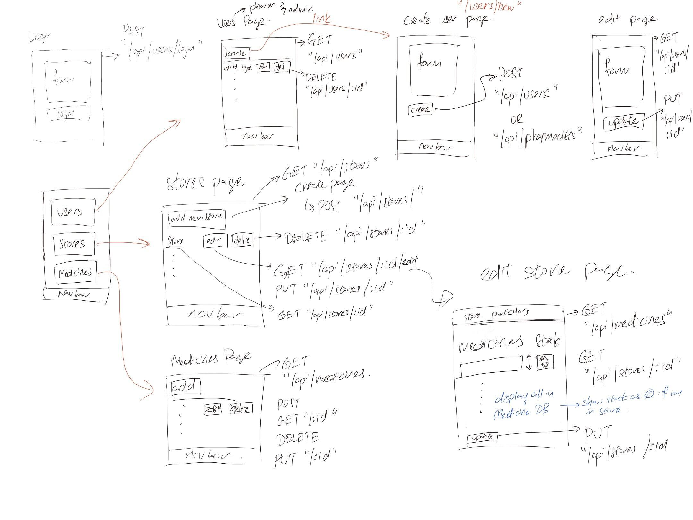
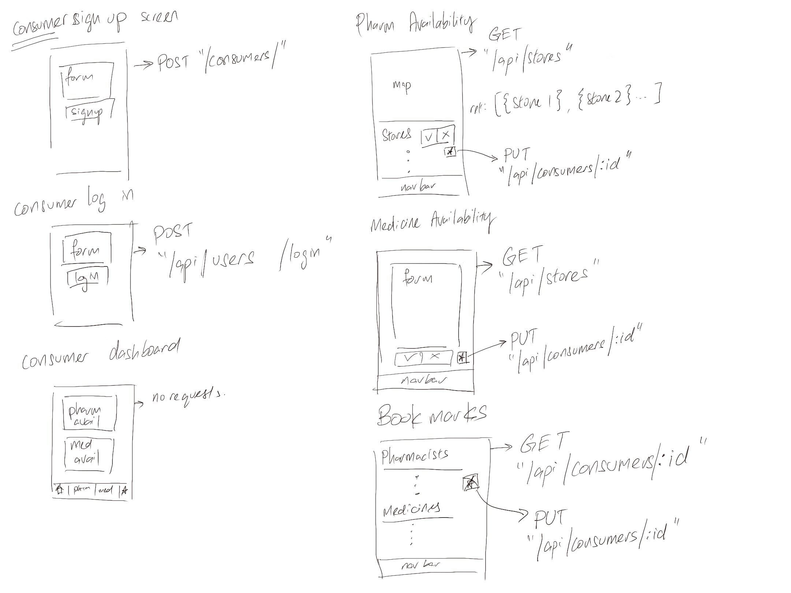
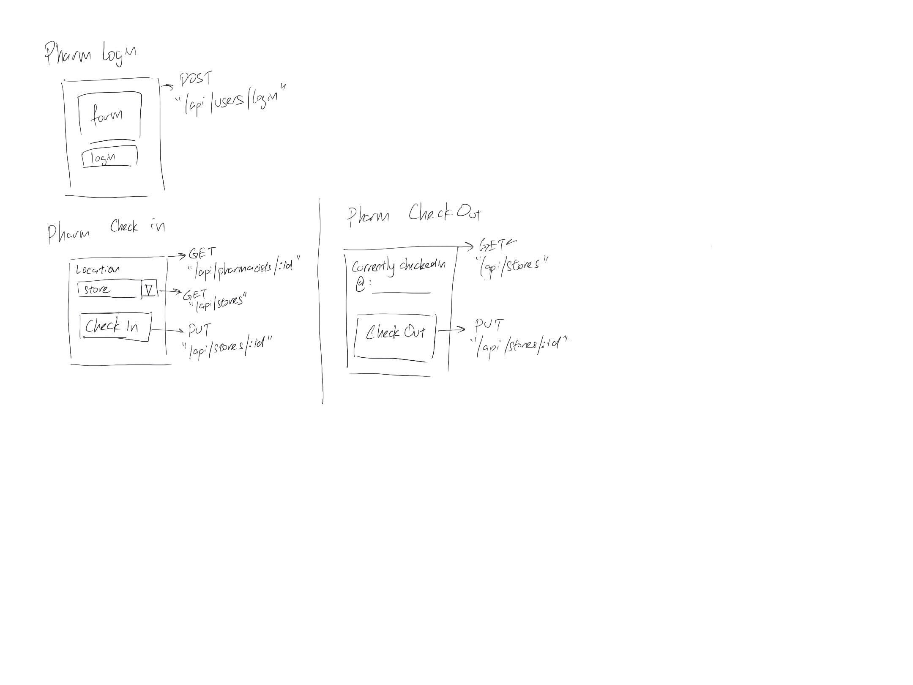
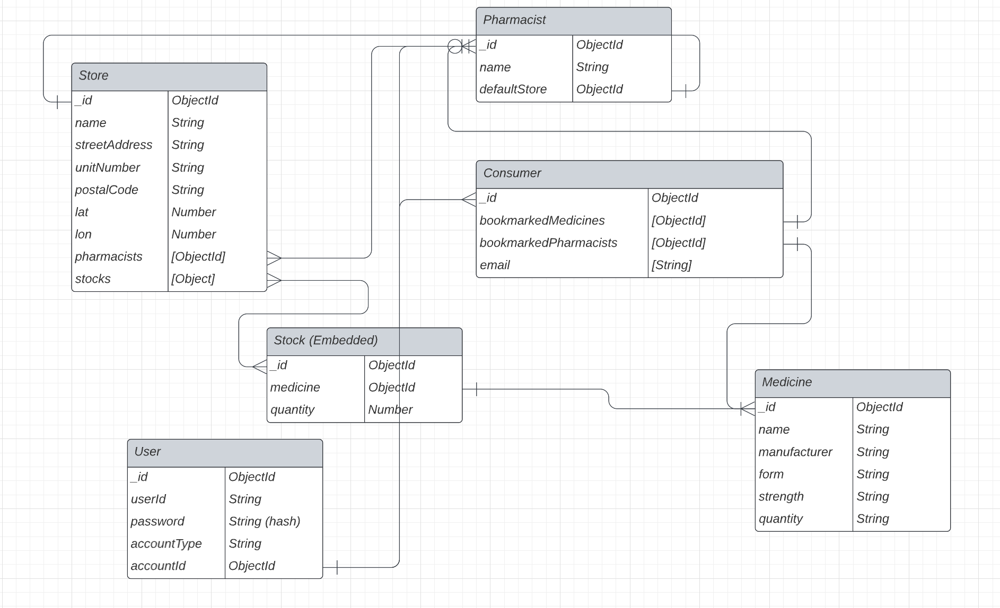
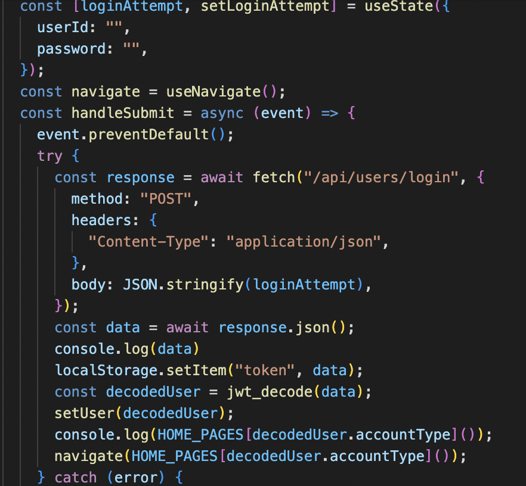
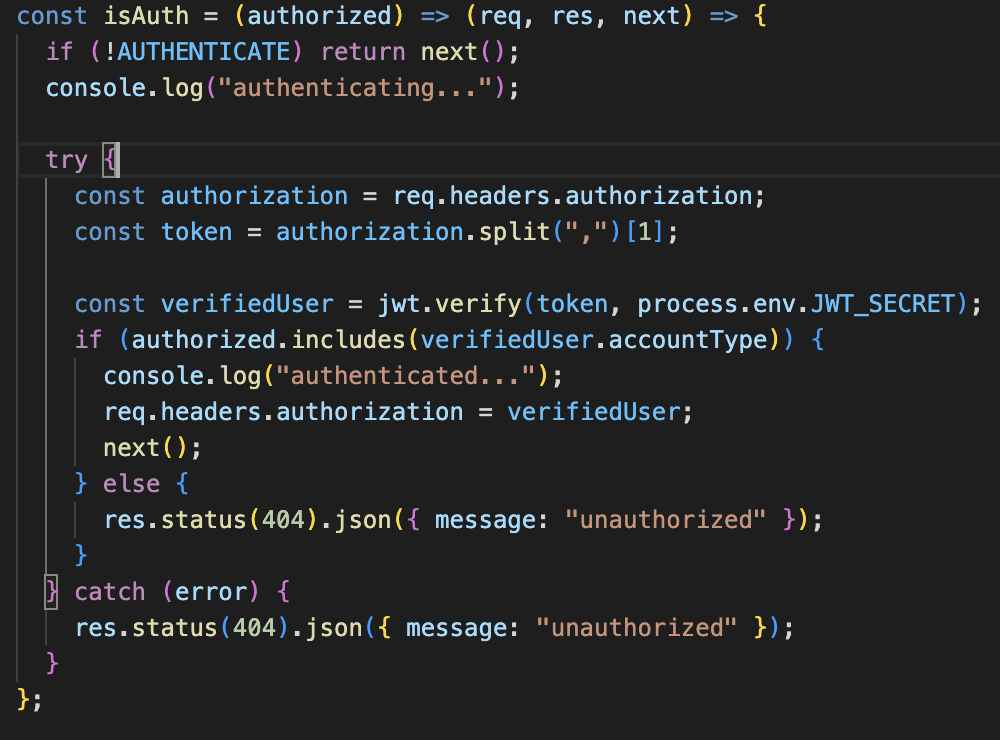
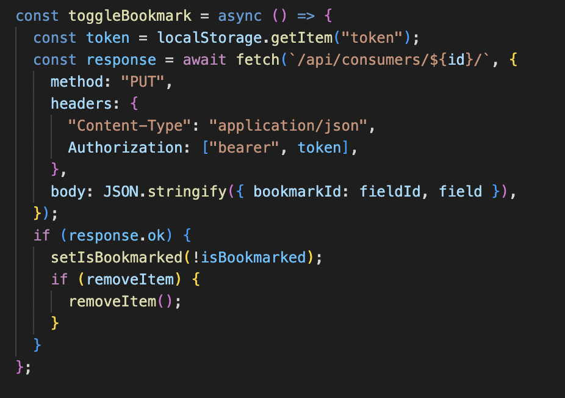

# Description
A MERN stack app that is being developed as a class project at General Assembly. The purpose of the application is to provide a platform for users to check the availability of medicines and pharmacists. The app is built using React for the front-end, Node.js and Express for the back-end, and MongoDB for the database.

# Technologies & Tools Used
- JavaScript
- HTML
- CSS
- React (v18.2.0)
- Express (v4.18.2)
- Leaflet (v1.9.3)
- Mongoose (v7.0.3)
- MongoDB
- Vite (v4.2.0)
- PostCSS (v8.4.21)
- Tailwind CSS (v3.3.1)
- dotenv (v16.0.3)
- nodemon (v2.0.22)
- bcrypt (v5.1.0)
- jsonwebtoken (v9.0.0)

# Wireframe

# User Stories
As a consumer user, I want to 
- Log in or sign up for an account.
- Verify the availability of the desired medicine at a particular store.
- Check the availability of pharmacists at the store.
- Utilize bookmark function to keep track of selected medicines and pharmacists. 

As a admin/pharmacists user, I want to 
- Log in and create admin/pharmacists accounts.
- Edit or delete user accounts as needed.
- Check in and out of the store to reflect my availability at the selected store.
- Update the quantity of medicine available at the store.
- Add, edit, or delete medicines to keep the inventory up to date.
- Add, edit, or delete store information as needed.

# Model

# Deployment
This app is deployed on [Cyclic](https://enchanting-shrug-pike.cyclic.app) .

# Breakdown & Analysis of Code
When user login, the handleSubmit function sends a POST request to the server's /api/users/login endpoint. If the credentials are correct, the server returns a token in the response, which is stored in the browser's local storage using the localStorage.setItem() method. The token is then decoded using the jwt_decode library, which extracts the user's account information from the token payload. The account information is used to determine which page the user should be redirected to, based on their account type.

isAuth function checks if the user is authenticated by verifying the token in the Authorization header of the request. If the token is valid and the user's account type is authorized to access the protected route, the middleware passes the request to the next handler.

The bookmarks array is extracted from the response data and checked to see if it contains the fieldId prop. If it does, the isBookmarked state variable is set to true, which will cause the component to render an "Unbookmark" icon. If it doesn't, isBookmarked remains false, which will cause the component to render a "Bookmark" icon. When the user clicks the bookmark button, the function makes an HTTP PUT request to update the list of bookmarked items for the user. If the request is successful, the function updates the state to reflect the new bookmark status of the item.

